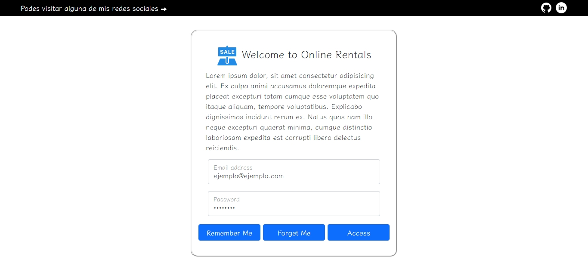

## `ONLINE RENTALS`

## `Descripción.`
Este proyecto presenta la oportunidad de que el usuario interactue con una inmobiliaria online en la cual pueda realizar una reserva de la propiedad que escoja dentro de una serie de opciones las cuales podra ver en detalle
La finalidad del proyecto es proponer un atajo al tiempo y al dinero tanto de la inmobiliaria como del usuario ya que al realizar la reserva desde la pagina se evita colicion en la inmobiliaria fisica, ver mas de una propiedad, dirijirse hacia el lugar en mas de uan ocasion, etc..

## `Instalación.`

Este proyecto fue creado con HTML, CSS y JavaScript con librerias unicamente dedicadas a la estilizacion y animacion del proyecto. Por eso, una vez descargado/clonado este repositorio, para su ejecución no se necesitan instalar depedenccias ya que vienen integrados los CDN de las librerias en el archivo index.html.

## `Demo.`
Si deseas visitar esta pagina puedes hacerlo mediante este enlace: [Project demo](https://ecommerce-vans-joseottonello.vercel.app/)

## `Preview.`

